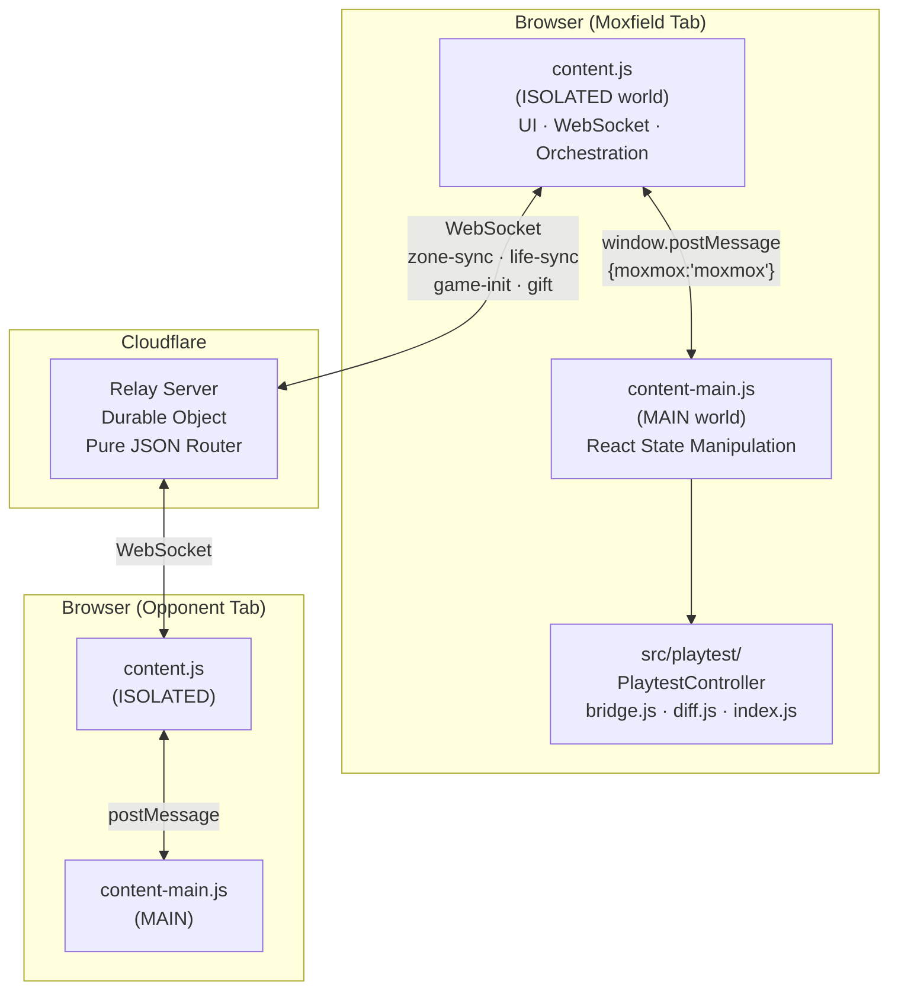
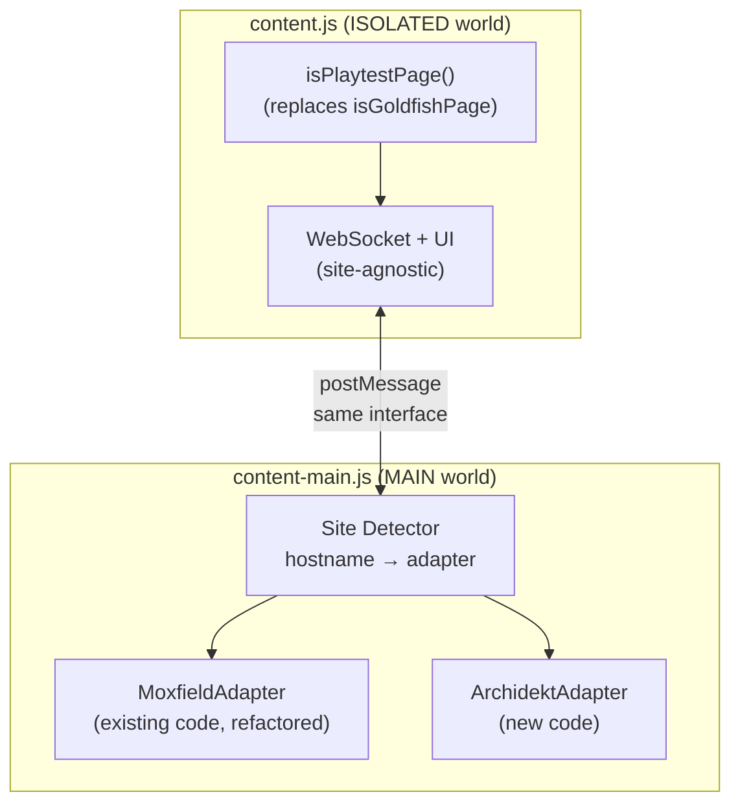
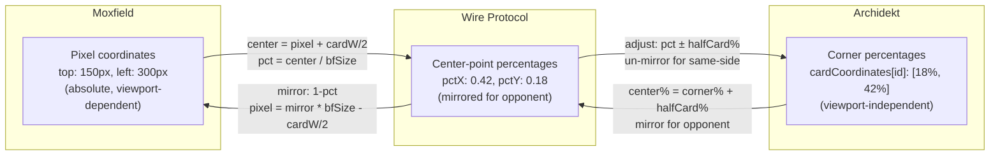
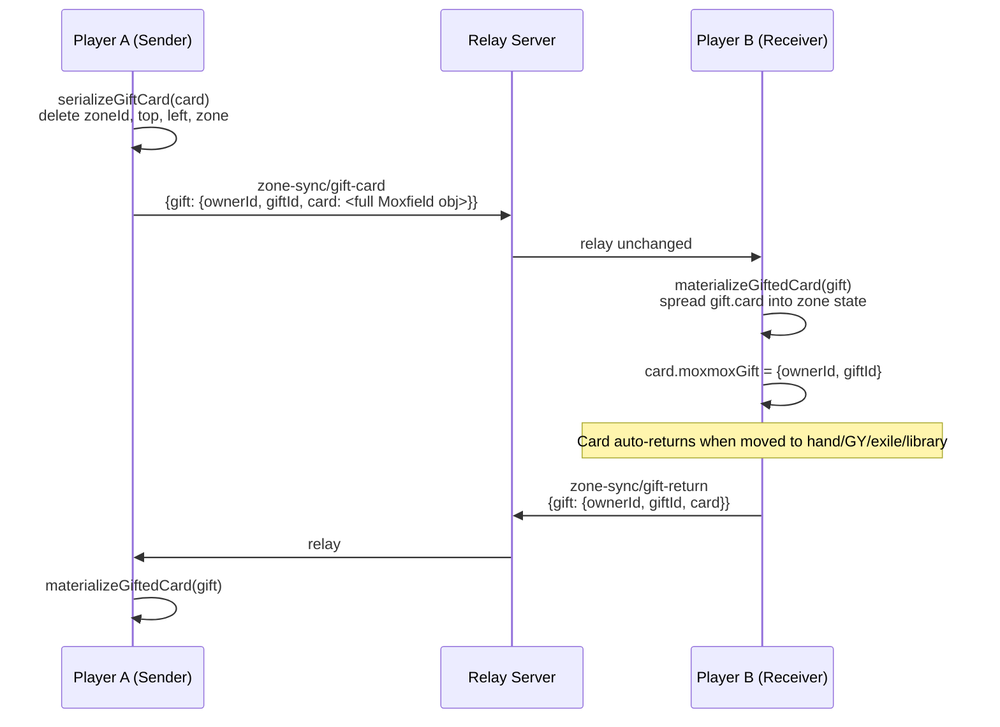

# Multi-Site Playtester Support: Moxfield + Archidekt

## Executive Summary

MoxMox can be extended to support mix-and-match play between Moxfield and Archidekt with **zero server changes** — the relay server is a pure JSON message router with no card or site knowledge[^1]. All site coupling lives in the browser extension's two content scripts. The key architectural insight is that MoxMox already has a clean ISOLATED/MAIN world split[^2]: the ISOLATED world (`content.js`) handles UI, WebSocket, and game orchestration in a largely site-agnostic way, while the MAIN world (`content-main.js`) handles all React state manipulation. The strategy is to introduce a **Site Adapter** pattern: extract a common interface from the MAIN-world code, implement it once for Moxfield (largely existing code) and once for Archidekt (new code targeting their Redux store), and make the wire protocol site-neutral by adding `scryfallId` alongside the existing `cardId`.

---

## Table of Contents

1. [Current Architecture Overview](#1-current-architecture-overview)
2. [Archidekt Technical Profile](#2-archidekt-technical-profile)
3. [Abstraction Strategy: Site Adapter Pattern](#3-abstraction-strategy-site-adapter-pattern)
4. [Wire Protocol Changes](#4-wire-protocol-changes)
5. [Neutral Card Identification via Scryfall](#5-neutral-card-identification-via-scryfall)
6. [Zone Name Mapping](#6-zone-name-mapping)
7. [Card State Field Mapping](#7-card-state-field-mapping)
8. [Coordinate System Normalization](#8-coordinate-system-normalization)
9. [Counter Model Normalization](#9-counter-model-normalization)
10. [Gift Card Mechanism](#10-gift-card-mechanism)
11. [Manifest & Build System Changes](#11-manifest--build-system-changes)
12. [Implementation Roadmap](#12-implementation-roadmap)
13. [Confidence Assessment](#13-confidence-assessment)

---

## 1. Current Architecture Overview



### Site-Specific Coupling Points

The following elements are hardcoded to Moxfield[^3][^4]:

| Component | Moxfield Coupling | Location |
|-----------|-------------------|----------|
| Manifest URL match | `"https://moxfield.com/*"` | `manifests/base.json:24-47` |
| Page detection | `isGoldfishPage()` checks `hostname === 'moxfield.com'` | `src/shared/room.js:82-92` |
| React bridge | Fiber traversal from `img[alt="Card Image"]`, `nav li` selectors | `src/playtest/bridge.js:22-58` |
| Instance validation | Duck-types `handleSaveData`, `handleDraw`, `handleShuffle` methods | `src/playtest/bridge.js:75-91` |
| Card materialization | `getInstance().getCardFromId(cardId)` — Moxfield method | `src/content-main.js:740` |
| Mutation mechanism | `instance.setState()` + `instance.handleSaveData()` | `src/playtest/index.js:176-193` |
| UI injection | Widget inserted before zoom `<li>` in Moxfield's `<nav>` | `src/content.js:302-399` |
| Battlefield container | `inst._battlefieldContainer.current` React ref | `src/content-main.js:866-884` |
| Toolbar width | Hardcoded `120px * zoom` for Moxfield toolbar | `src/content-main.js:849-851` |
| Card coordinates | Pixel `top`/`left` on card objects | `src/playtest/diff.js:3-7` |

---

## 2. Archidekt Technical Profile

| Layer | Technology |
|-------|-----------|
| Framework | **Next.js** (SSR + client-side routing)[^5] |
| UI Library | **React** functional components + hooks |
| State Management | **Redux** (`@reduxjs/toolkit` pattern) — `playtesterV2` slice[^5] |
| Drag & Drop | react-dnd (HTML5 + touch backends) |
| CSS | CSS Modules (hashed class names, e.g., `playtesterV2_container__27nQy`) |
| Card Images | `storage.googleapis.com/archidekt-card-images/{setCode}/{uid}_art_crop.jpg` |
| Deck Data | Available in `__NEXT_DATA__` (SSR) + public REST API: `GET /api/decks/{id}/` |
| localStorage | `playtester-redux-state` key for save/restore |

### Archidekt Redux State Structure (playtesterV2 slice)[^5]

```js
store.getState().playtesterV2 = {
  // Zones (arrays of CardMeta)
  battlefield, hand, library, graveyard, exile,
  commandZone, sideboard, miscCards, attractions, junkyard, planes, tokens,

  // Card lookup & positioning
  allCards: { [shortId]: CardData },       // deck card definitions
  cardCoordinates: { [metaId]: [y%, x%] }, // separate position map

  // Game counters
  lifeTotal, lifeTotal2, turnCounter,
  whiteMana, blueMana, blackMana, redMana, greenMana, colorlessMana, energy,
  infectDamage, experiance, commanderDamangeOne..Four,

  // UI state, settings, undo/redo...
}
```

### Archidekt CardMeta (per-instance card state)[^5]

```js
{
  id: string,          // nanoid instance ID
  cardId: string,      // key into allCards{}
  tapped: boolean,
  flipped: boolean,    // DFC transform
  faceDown: boolean,   // morph/manifest
  upsideDown: boolean, // 180° rotation
  dimmed: boolean,
  token: boolean,
  counters: { [name]: { count, icon?, primary? } }, // rich named counters
  customPowerOffset: number,
  customToughnessOffset: number,
  commandTax: number,
}
```

### Accessing the Redux Store[^6]

Two viable approaches:

**Method A — React Fiber Traversal** (works after page load):
```js
function findArchidektStore() {
  const root = document.getElementById('__next');
  const fiberKey = Object.keys(root).find(k => k.startsWith('__reactFiber'));
  let fiber = root[fiberKey];
  while (fiber) {
    const ctx = fiber.memoizedProps?.value;
    if (ctx?.store?.getState?.().playtesterV2) return ctx.store;
    fiber = fiber.return;
  }
  return null;
}
```

**Method B — Action Type Discovery** (intercept first dispatch):
```js
const origDispatch = store.dispatch.bind(store);
let SET_STATE_TYPE;
store.dispatch = function(action) {
  if (!SET_STATE_TYPE && action.payload &&
      Object.keys(action.payload).some(k =>
        ['battlefield','hand','lifeTotal'].includes(k))) {
    SET_STATE_TYPE = action.type;
  }
  return origDispatch(action);
};
```

### Key Architectural Differences

| Aspect | Moxfield | Archidekt |
|--------|----------|-----------|
| State access | React fiber → class instance `.state` | Redux `store.getState()` |
| Change detection | Monkeypatch `handleSaveData()` | `store.subscribe()` |
| Mutation | `instance.setState()` + `handleSaveData()` | `store.dispatch({ type, payload })` |
| Card instance ID | `zoneId` (string) | `id` (nanoid) |
| Position coordinates | Pixel `{top, left}` on card object | Percent `[y%, x%]` in separate `cardCoordinates` map |
| Counter model | `counters: number` (single integer) | `counters: { [name]: {count, icon} }` (rich named) |
| Component type | React class component | React functional components |

---

## 3. Abstraction Strategy: Site Adapter Pattern

The recommended approach is a **single set of content scripts with site-specific adapters**, not separate scripts per site[^7].



### Site Adapter Interface

Each adapter implements a uniform interface consumed by the ISOLATED world via `postMessage`:

```ts
interface SiteAdapter {
  // Detection
  isPlaytestPath(): boolean;

  // Initialization
  findInstance(): Promise<GameInstance>;  // React class OR Redux store
  createController(instance: GameInstance): PlaytestController;

  // Card operations
  getCardFromId(cardId: string, scryfallId: string): CardTemplate | null;
  materializeCard(template: CardTemplate, zone: string, props: object): Card;
  serializeCard(card: Card): NeutralCardData;

  // Battlefield
  getBattlefieldSize(): { width, height, usableWidth, cardW, cardH };
  getBattlefieldContainer(): HTMLElement;

  // UI injection
  findToolbarAnchor(): HTMLElement;
  getToolbarWidth(zoom: number, cardW: number): number;

  // Zone translation
  toWireZone(localZone: string): string;
  fromWireZone(wireZone: string): string;

  // State translation
  toWireState(localState: object): object;
  fromWireState(wireState: object): object;

  // Counter translation
  toWireCounters(localCounters: any): { [name: string]: number };
  fromWireCounters(wireCounters: { [name: string]: number }): any;
}
```

### What Changes Per Layer

| Layer | Changes Needed |
|-------|---------------|
| **Server** (`server/src/index.js`) | **None** — pure JSON relay[^1] |
| **content.js** (ISOLATED) | Replace `isGoldfishPage()` → `isPlaytestPage()`; UI injection uses adapter's `findToolbarAnchor()` |
| **content-main.js** (MAIN) | Dispatch to site adapter; adapter handles `findInstance`, `createController`, all sync commands |
| **PlaytestController** (`src/playtest/index.js`) | Already generic if given a conforming instance; needs minor refactor for non-class components |
| **bridge.js** | Keep as `moxfield-bridge.js`; write new `archidekt-bridge.js` |
| **diff.js** | Fully site-agnostic already — pure functions on zone snapshots[^8] |

---

## 4. Wire Protocol Changes

The current wire protocol uses Moxfield's internal `cardId` for card identification[^9]. For cross-site play, the protocol needs a neutral card identifier.

### Proposed Message Changes

**`zone-sync` messages** — add `scryfallId`:
```js
// Before (Moxfield-only):
{ type: 'zone-sync', action: 'add-battlefield',
  cardId: "Lmx63", syncId: "abc123", pctX: 0.42, pctY: 0.18 }

// After (cross-site compatible):
{ type: 'zone-sync', action: 'add-battlefield',
  cardId: "Lmx63",                    // kept for Moxfield-to-Moxfield compat
  scryfallId: "bfc43c37-...",          // NEW: neutral cross-site key
  syncId: "abc123", pctX: 0.42, pctY: 0.18 }
```

**`game-init` message** — add `scryfallId` to library entries:
```js
{ type: 'game-init',
  library: [
    { cardId: "Lmx63", scryfallId: "bfc43c37-...", syncId: "abc123" },
    ...
  ]
}
```

**`update-state` message** — use wire-neutral counter format:
```js
// Before:
{ updates: { counters: 5 } }

// After:
{ updates: { counters: { "+1/+1": 5 } } }
```

### Server RELAY_FIELDS Whitelist Update

Add `scryfallId` to the `zone-sync` field whitelist[^1]:
```js
'zone-sync': new Set([
  'action', 'zone', 'cardId', 'scryfallId', 'syncId',  // ← add scryfallId
  'pctX', 'pctY', 'fromZone', 'toZone', 'updates',
  'syncIds', 'cards', 'targetId', 'gift'
]),
```

This is the **only server change** needed.

---

## 5. Neutral Card Identification via Scryfall

Both sites already carry the Scryfall printing UUID natively[^10]:

| Site | Scryfall UUID Field | Set Code | Collector Number |
|------|-------------------|----------|-----------------|
| Moxfield | `card.scryfall_id` | `card.set` | `card.cn` |
| Archidekt | `card.uid` | `card.edition.editioncode` | `card.collectorNumber` |
| Scryfall API | `card.id` | `card.set` | `card.collector_number` |

### Image URL Construction (No API Call Needed)

```js
function scryfallImageUrl(scryfallId, size = 'normal', face = 'front') {
  return `https://cards.scryfall.io/${size}/${face}/${scryfallId[0]}/${scryfallId[1]}/${scryfallId}.jpg`;
}
```

### Card Lookup Strategy Per Site

**Moxfield receiver**: Continue using `getCardFromId(cardId)` when available; fall back to matching `card.scryfall_id === scryfallId` in the deck data[^11].

**Archidekt receiver**: Search `store.getState().playtesterV2.allCards` for entry where `card.uid === scryfallId`[^5].

### DFC / Split Card Handling

DFC layouts (`transform`, `modal_dfc`, `reversible_card`) use the same `scryfall_id` but different face images:
```js
// Front: .../front/{a}/{b}/{uuid}.jpg
// Back:  .../back/{a}/{b}/{uuid}.jpg
```
The `layout` and `card_faces` fields must be included in gift/reveal messages so the receiver knows to render both faces[^10].

---

## 6. Zone Name Mapping

The wire protocol currently uses Moxfield zone names verbatim[^12]. A translation layer is needed:

| Wire Protocol (Neutral) | Moxfield Internal | Archidekt Internal | Notes |
|-------------------------|-------------------|-------------------|-------|
| `battlefield` | `battlefield` | `battlefield` | ✅ Match |
| `hand` | `hand` | `hand` | ✅ Match |
| `library` | `library` | `library` | ✅ Match |
| `graveyard` | `graveyard` | `graveyard` | ✅ Match |
| `exile` | `exile` | `exile` | ✅ Match |
| `sideboard` | `sideboard` | `sideboard` | ✅ Match |
| `junkyard` | `junkyard` | `junkyard` | ✅ Match |
| `attractions` | `attractions` | `attractions` | ✅ Match |
| `planes` | `planes` | `planes` | ✅ Match |
| `command` | `command` | `commandZone` | ⚠️ **Name mismatch** |
| `scrapyard` | `scrapyard` | *(none)* | Moxfield-only |
| `signatureSpells` | `signatureSpells` | *(none)* | Moxfield-only |
| `contraptions` | `contraptions` | *(none)* | Moxfield-only |
| `schemes` | `schemes` | *(none)* | Moxfield-only |
| `stickers` | `stickers` | *(none)* | Moxfield-only |
| `miscCards` | *(none)* | `miscCards` | Archidekt-only |

### Shared Zone Configuration[^12]

```js
// Current (src/content.js:25):
const SHARED_ZONES = new Set(['library', 'graveyard', 'exile']);
```

These zones are shared in Shared Deck mode. The zone names `library`, `graveyard`, and `exile` are consistent across both sites. The `command`/`commandZone` mismatch only matters if command zone sync is added in the future.

---

## 7. Card State Field Mapping

### Boolean State Fields

| Wire Protocol | Moxfield | Archidekt | Notes |
|--------------|----------|-----------|-------|
| `tapped` | `tapped` | `tapped` | ✅ Direct match |
| `flipped` | `flipped` | `faceDown` | ⚠️ Name mismatch, same semantic |
| `rotated` | `rotated` | `upsideDown` | ⚠️ Name mismatch, same semantic |
| `doesntUntap` | `doesntUntap` | *(none)* | Moxfield-only; Archidekt ignores |
| `dimmed` | *(none)* | `dimmed` | Archidekt-only; Moxfield ignores |

### Power/Toughness Adjustment — Semantic Mismatch[^12]

| Moxfield | Archidekt | Semantic Difference |
|----------|-----------|-------------------|
| `adjustedPower: 5` | `customPowerOffset: 2` | Moxfield stores **absolute** adjusted value; Archidekt stores **offset** from printed. A 3/3 with +2 power: Moxfield = `5`, Archidekt = `+2`. |
| `adjustedToughness: 5` | `customToughnessOffset: 2` | Same as above |
| `adjustedLoyalty: 4` | *(none)* | Moxfield-only |

**Translation requires** knowing the card's printed power/toughness. The adapter's `toWireState`/`fromWireState` methods must perform:
```
wireAdjustedPower = archidektOffset + printedPower  // Archidekt → wire
archidektOffset = wireAdjustedPower - printedPower   // wire → Archidekt
```

---

## 8. Coordinate System Normalization



### Current MoxMox Wire Format[^13]

Positions are transmitted as **center-point fractions** of battlefield dimensions:
```js
// Sending (content.js:1667-1677):
const pctX = centerX / usableWidth;  // fraction of width
const pctY = centerY / height;       // fraction of height

// Receiving — mirror for opponent view:
const mirroredCX = (1 - pctX) * usableWidth;
const mirroredCY = (1 - pctY) * height;
```

### Archidekt Position System[^5]

Archidekt stores positions as **top-left corner percentages** in a separate map:
```js
cardCoordinates[metaId] = [topPercent, leftPercent]
```

### Translation

**Archidekt → Wire**: Convert corner % to center % by adding half a card's percentage size:
```js
const [topPct, leftPct] = cardCoordinates[id];
const cardWPct = cardPixelWidth / battlefieldPixelWidth * 100;
const cardHPct = cardPixelHeight / battlefieldPixelHeight * 100;
const pctX = (leftPct + cardWPct / 2) / 100;
const pctY = (topPct + cardHPct / 2) / 100;
```

**Wire → Archidekt**: Reverse (mirror, then subtract half card):
```js
const mirroredPctX = 1 - pctX;
const mirroredPctY = 1 - pctY;
const leftPct = mirroredPctX * 100 - cardWPct / 2;
const topPct = mirroredPctY * 100 - cardHPct / 2;
cardCoordinates[metaId] = [topPct, leftPct];
```

Archidekt's percentage-based system is advantageous — it already handles different viewport sizes without normalization[^5].

---

## 9. Counter Model Normalization

This is the most significant semantic gap between the two sites[^12].

| Moxfield | Wire (Current) | Wire (Proposed) | Archidekt |
|----------|---------------|-----------------|-----------|
| `counters: 5` | `counters: 5` | `counters: {"+1/+1": 5}` | `counters: {"+1/+1": {count:5, icon:"...", primary:true}}` |

### Proposed Wire Format

Extend counters to a **named map of counts** (dropping display-only fields):
```js
// Wire format:
{ counters: { "+1/+1": 3, "loyalty": 2, "shield": 1 } }
```

### Adapter Translation

**Moxfield → Wire**: Moxfield's single integer becomes `{"+1/+1": n}` (best approximation; Moxfield doesn't track counter types).

**Wire → Moxfield**: Sum all counter values into a single integer (lossy but matches Moxfield's model).

**Archidekt → Wire**: Drop `icon`, `color`, `primary` from each counter entry; keep `name → count`.

**Wire → Archidekt**: Reconstruct the rich counter object with default `icon` and `primary` values from Archidekt's counter type definitions.

---

## 10. Gift Card Mechanism

Gift cards currently serialize the **full Moxfield card object** (minus positional fields) and spread it directly into the receiver's React state[^14]. This is the most tightly coupled feature.

### Current Gift Flow[^14]



### Proposed Neutral Gift Card Format

Replace the full Moxfield object with a minimal, Scryfall-standard payload:

```js
{
  // Card identity (Scryfall-standard)
  scryfallId: "bfc43c37-...",
  name: "Dandân",
  set: "chr",
  cn: "18",
  layout: "normal",
  card_faces: [],

  // Gameplay metadata
  type_line: "Creature — Fish",
  mana_cost: "{U}{U}",
  cmc: 2,
  power: "4",
  toughness: "1",

  // MoxMox tracking
  syncId: "abc123",

  // Playtest state at time of gifting
  tapped: false,
  flipped: false,
  rotated: false,
  counters: { "+1/+1": 0 },
  adjustedPower: 4,
  adjustedToughness: 1,
}
```

Each site's adapter materializes this into its own internal card format — Moxfield looks up via `getCardFromId(cardId)` or falls back to `scryfall_id` match; Archidekt searches `allCards` for matching `uid`.

---

## 11. Manifest & Build System Changes

### Manifest Changes (`manifests/base.json`)[^3]

```json
{
  "host_permissions": [
    "http://localhost:8787/*",
    "https://api.github.com/*",
    "https://*.workers.dev/*",
    "https://archidekt.com/*"           // ← NEW
  ],
  "content_scripts": [
    {
      "matches": [
        "https://moxfield.com/*",
        "https://archidekt.com/*"        // ← NEW
      ],
      "js": ["content.js"],
      "css": ["styles.css"],
      "run_at": "document_idle"
    },
    {
      "matches": [
        "https://moxfield.com/*",
        "https://archidekt.com/*"        // ← NEW
      ],
      "js": ["content-main.js"],
      "world": "MAIN",
      "run_at": "document_idle"
    }
  ]
}
```

### Page Detection (`src/shared/room.js`)[^7]

```js
// Replace isGoldfishPage() with:
export function isPlaytestPage(urlString) {
  const url = new URL(urlString);
  if (url.hostname === 'moxfield.com')
    return /^\/decks\/[^/]+\/goldfish$/.test(url.pathname);
  if (url.hostname === 'archidekt.com')
    return /^\/playtester-v2\/\d+/.test(url.pathname);
  return false;
}
```

### Build System (`build.js`)[^7]

No structural changes needed if site adapters are imported by `content-main.js` — esbuild bundles with `bundle: true`, so imports are inlined automatically. The `BUNDLE_ENTRIES` array stays the same.

### Proposed File Structure

```
src/
  content.js              # ISOLATED world (minimal changes)
  content-main.js         # MAIN world (dispatch to adapter)
  shared/
    room.js               # isPlaytestPage() replaces isGoldfishPage()
    card-identity.js      # NEW: scryfallImageUrl(), neutral card format helpers
  sites/
    adapter.js            # NEW: SiteAdapter interface definition
    moxfield/
      adapter.js          # MoxfieldAdapter (refactored from existing code)
      bridge.js           # existing bridge.js (renamed)
    archidekt/
      adapter.js          # NEW: ArchidektAdapter
      bridge.js           # NEW: Redux store discovery + subscribe
  playtest/
    index.js              # PlaytestController (generic, minor refactor)
    diff.js               # unchanged — pure functions
```

---

## 12. Implementation Roadmap

### Phase 1: Abstraction Layer (No Archidekt code yet)

1. **Extract SiteAdapter interface** from existing `content-main.js`
2. **Create MoxfieldAdapter** — wrap existing code behind the interface
3. **Add site detection** — `isPlaytestPage()` replaces `isGoldfishPage()`
4. **Add `scryfallId` to wire messages** — backwards-compatible addition
5. **Update counter wire format** — `counters: number` → `counters: {name: count}`
6. **Refactor `serializeGiftCard`** — explicit allowlist instead of delete-blocklist
7. **Tests** — all existing tests must pass; add tests for the adapter interface

### Phase 2: Archidekt Investigation (Browser DevTools)

1. **Create `ARCHIDEKT_INTERNALS.md`** — analogous to `MOXFIELD_INTERNALS.md`
2. **Discover Redux store access** — test fiber traversal and action type sniffing in a live browser
3. **Map Archidekt's state mutations** — verify `store.dispatch({type, payload})` works
4. **Identify DOM anchor points** — where to inject MoxMox UI on Archidekt
5. **Document the `allCards` lookup** — how to find a card by `scryfallId` / `uid`

### Phase 3: Archidekt Adapter Implementation

1. **`archidekt/bridge.js`** — Redux store discovery via fiber traversal
2. **`archidekt/adapter.js`** — Full SiteAdapter implementation:
   - `findInstance()` → find Redux store
   - `createController()` → return PlaytestController configured for Redux
   - Zone/state/counter translation methods
   - Battlefield size calculation from `#play-area-v2`
3. **PlaytestController refactor** — abstract away `setState`/`handleSaveData` into pluggable mutation strategy
4. **UI injection** — adapt toolbar widget for Archidekt's layout
5. **Integration tests** — test cross-site sync with mock adapters

### Phase 4: Cross-Site Play

1. **End-to-end testing** — one browser tab on Moxfield, one on Archidekt, connected to the same room
2. **Handle edge cases** — site-only zones, missing card matches, counter translation loss
3. **Shared Deck mode** — requires both players to have the same deck; invite URL must encode both site URLs
4. **Traditional mode** — each player has their own deck on their own site; fewer coupling issues

---

## 13. Confidence Assessment

### High Confidence

- **Server requires zero changes** (except adding `scryfallId` to the relay whitelist) — confirmed by complete code review[^1]
- **Wire protocol is event-driven diffs**, not full state — confirmed[^9]
- **Both sites use Scryfall UUIDs natively** (`card.scryfall_id` on Moxfield, `card.uid` on Archidekt) — confirmed from code and live API[^10]
- **Archidekt uses Redux with a single merge-state action type** — confirmed from minified chunk analysis[^6]
- **9 of 11 zone names match exactly** between Moxfield and Archidekt[^12]
- **diff.js is fully site-agnostic** — pure functions, no DOM/React dependency[^8]
- **The ISOLATED world (content.js) is largely site-agnostic** — the coupling is almost entirely in the MAIN world[^3]

### Medium Confidence

- **Redux store discoverable via fiber traversal** — the approach is well-established but not tested against Archidekt's specific React tree; Archidekt may use a non-standard Provider wrapping
- **Action type sniffing will work** — intercepting `store.dispatch` to capture the SET_STATE type is a common pattern, but Archidekt could use middleware that complicates this
- **Archidekt's `allCards` map is keyed by an internal shortId** that maps to a card with a `uid` field — confirmed from `__NEXT_DATA__` inspection, but the runtime Redux state shape may differ from the SSR hydration shape
- **Coordinate translation between center-point % and corner-point %** will work correctly — the math is straightforward but edge cases (card stacking, grouped cards) are untested

### Lower Confidence / Needs Live Verification

- **Archidekt's exact URL pattern for the playtester** — confirmed as `/playtester-v2/{deckId}` from page fetch, but whether there are other URL forms (e.g., `/decks/{id}/playtest` vs `/playtester-v2/{id}`) needs verification
- **Archidekt's undo/redo stack** — direct `dispatch({type, payload})` may bypass the undo recording mechanism, which could confuse users[^6]
- **Archidekt's context menu structure** — needed for gift menu injection; completely uninvestigated
- **Power/toughness offset semantics** — inferred that Archidekt uses offset (delta from printed), but this needs live verification against actual Archidekt game state
- **Library card ordering convention** — Moxfield puts top card at `library[length-1]`[^4]; Archidekt's convention is unconfirmed

---

## Footnotes

[^1]: Server implementation reviewed in full at `server/src/index.js`. RELAY_FIELDS whitelist at lines 22-32. The server knows nothing about cards, decks, or sites — it's a pure JSON message router with per-room Durable Objects.

[^2]: Architecture documented in `manifests/base.json:24-47` — two content_scripts entries: one ISOLATED (default world), one MAIN (world: "MAIN"). Communication via `window.postMessage` with tag `{moxmox: 'moxmox'}`.

[^3]: All Moxfield-specific hardcoding cataloged: manifest URL patterns at `manifests/base.json:24-47`, `isGoldfishPage()` at `src/shared/room.js:82-92`, fiber selectors at `src/playtest/bridge.js:22-58`, instance validation at `src/playtest/bridge.js:75-91`.

[^4]: PlaytestController implementation at `src/playtest/index.js:28-602`. Mutation pattern: `instance.setState() → handleSaveData() → diff → emit events` at lines 176-193. ZONES constant at lines 14-19. Library ordering: top card at `library[length-1]`.

[^5]: Archidekt technology stack confirmed via live page fetch of `https://archidekt.com/playtester-v2/21256567`. Framework: Next.js (evidenced by `_next/static`, `__NEXT_DATA__`). State: Redux `playtesterV2` slice. State structure reverse-engineered from minified chunk `8239-bb511948dd6dfc4d.js`.

[^6]: Redux dispatch patterns discovered from minified chunk analysis. Single merge-state action `gJ(payload)` dispatches `{type: n.D_, payload}`. Store exported as `h` from webpack module 7300. Action type strings are minified — must be discovered at runtime.

[^7]: Multi-site architecture analysis based on: MV3 content_scripts documentation (multiple matches in one entry is valid), esbuild bundling behavior (imports inlined), and real-world multi-MTG-site extension `PhJack1/MTG_Translator` which uses runtime site detection with per-site selector configs.

[^8]: `src/playtest/diff.js` — `diffZones()` and `snapshotZones()` are pure functions operating on plain objects with no DOM, React, or site-specific dependencies. Confirmed by reviewing complete source and test coverage in `tests/playtest.test.js`.

[^9]: Wire protocol analysis: sync is event-driven diffs (zone transitions, card state changes), never full state dumps. `game-init` sends ordered library only. Card identity uses `cardId` (Moxfield internal) + `syncId` (MoxMox tracking). Documented from `src/content.js` sync handlers and server RELAY_FIELDS.

[^10]: Scryfall card identification: both Moxfield (`card.scryfall_id`) and Archidekt (`card.uid`) store the Scryfall printing UUID. Confirmed from `src/playtest/MOXFIELD_INTERNALS.md` and live Archidekt API response (`GET https://archidekt.com/api/decks/{id}/`). Image URLs constructable from UUID alone without API calls.

[^11]: Card materialization on Moxfield uses `getInstance().getCardFromId(cardId, usedZoneIds)` at `src/content-main.js:740,787`. This is a Moxfield React component method that searches deck data by Moxfield's internal card ID.

[^12]: Zone mapping and state field analysis from `src/content.js:25` (SHARED_ZONES), `src/playtest/index.js:14-19` (ZONES constant), `src/playtest/diff.js:3-7` (BATTLEFIELD_STATE_PROPS), and Archidekt Redux state structure from chunk analysis.

[^13]: Coordinate system: center-point percentage mirroring at `src/content.js:1667-1677` (sending) and `src/content.js:1817-1824` (receiving). Battlefield size calculation including toolbar width adjustment at `src/content-main.js:836-854`.

[^14]: Gift card mechanism: `serializeGiftCard()` at `src/content-main.js:563-570` clones full card object and deletes 4 fields. `materializeGiftedCard()` at `src/content-main.js:572-592` spreads the gift card directly into zone state. Gift flows documented in `src/content.js:641-660` (send) and `src/content.js:1881-1897` (receive).
